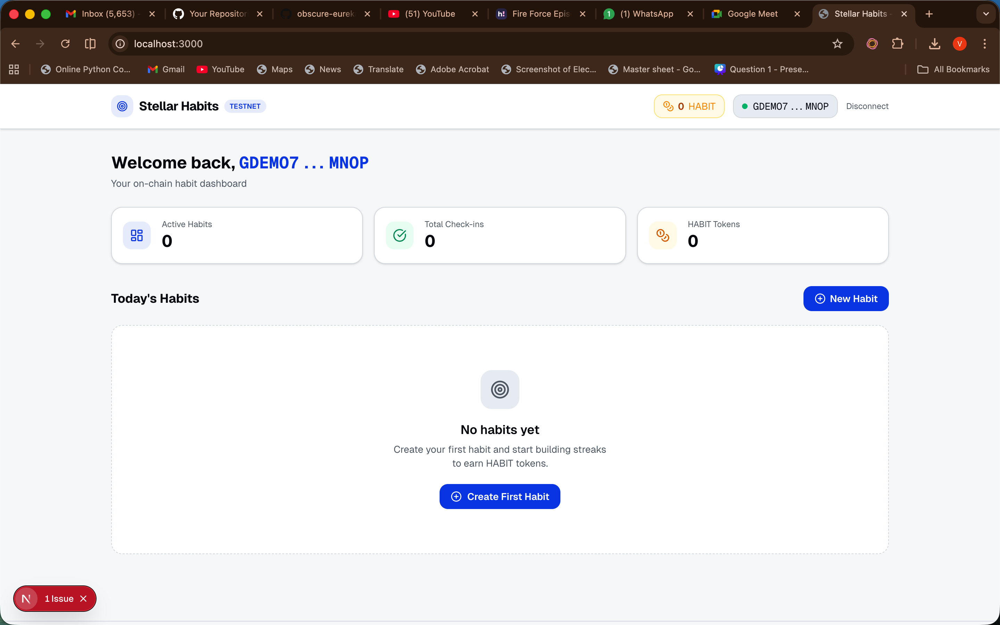
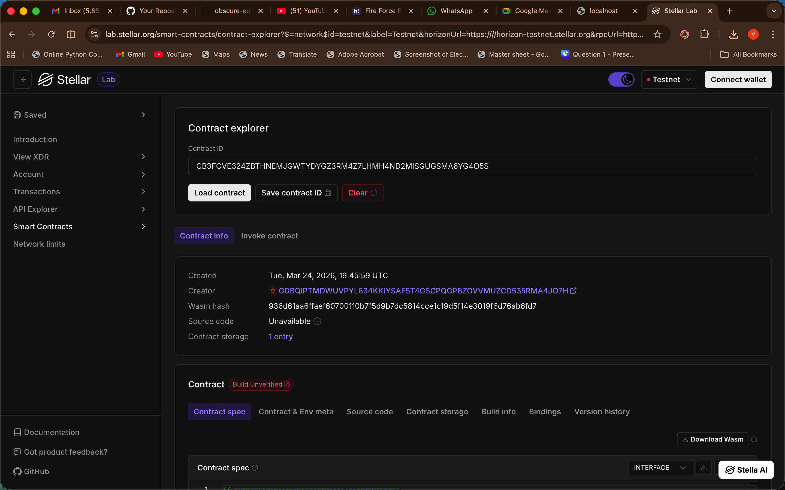

# 🌟 Stellar Habit Tracker

A decentralized habit tracking application built on the **Stellar Network** using **Soroban** smart contracts. Track your daily and weekly habits, maintain streaks, and earn on-chain token rewards for your consistency.

## 🚀 Live on Stellar Testnet

The smart contract is deployed and active on the Stellar Testnet.

- **Contract ID:** `CB3FCVE324ZBTHNEMJGWTYDYGZ3RM4Z7LHMH4ND2MISGUGSMA6YG4O5S`
- **Network:** Testnet
- **RPC URL:** `https://soroban-testnet.stellar.org`

## ✨ Features

- **Decentralized Tracking:** All your habits and streaks are stored securely on the Stellar blockchain.
- **Streak Logic:** Smart contract automatically calculates daily/weekly streaks based on ledger timestamps.
- **Token Rewards:** Earn "HABIT" tokens for every check-in, with multipliers for hitting 3-day, 7-day, 30-day, and 100-day milestones.
- **Premium UI:** A modern, high-performance dashboard built with Next.js and Tailwind CSS.
- **Wallet Integration:** Seamless connection with the Freighter wallet.

## 📸 Screenshots

### Dashboard Preview


### Stellar Labs Verification


## 🛠️ Tech Stack

- **Smart Contract:** Rust / Soroban SDK
- **Frontend:** Next.js (App Router), TypeScript, Tailwind CSS
- **Blockchain Connectivity:** `@stellar/stellar-sdk`, `@stellar/freighter-api`
- **Styling:** Lucide React Icons, Shadcn UI components

## 🏗️ Getting Started

### Prerequisites
- Node.js & npm/pnpm
- [Stellar CLI](https://developers.stellar.org/docs/build/smart-contracts/getting-started/setup#install-the-stellar-cli)
- [Freighter Wallet](https://www.freighter.app/)

### Installation

1. **Clone and install dependencies:**
   ```bash
   pnpm install
   ```

2. **Deploy the contract (Optional):**
   If you want to deploy your own instance, use the provided script:
   ```bash
   bash scripts/deploy.sh
   ```

3. **Configure Environment:**
   Ensure your `.env.local` has the following (generated automatically by the deploy script):
   ```env
   NEXT_PUBLIC_CONTRACT_ID=CB3FCVE324ZBTHNEMJGWTYDYGZ3RM4Z7LHMH4ND2MISGUGSMA6YG4O5S
   NEXT_PUBLIC_RPC_URL=https://soroban-testnet.stellar.org
   NEXT_PUBLIC_NETWORK_PASSPHRASE="Test SDF Network ; September 2015"
   ```

4. **Run the development server:**
   ```bash
   npm run dev
   ```
   Open [http://localhost:3000](http://localhost:3000) with your browser to see the result.

---
Built with 💜 on Stellar.
